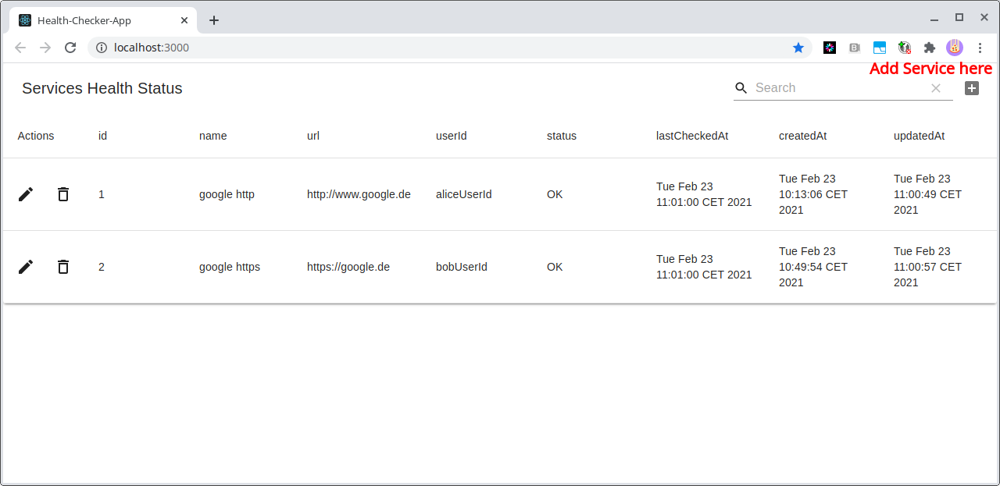

## Health Checker Example

Simple service for periodically polling of urls.
A CRUD REST API is provided for handling multiple services.
A React app os provided as simple UI.

## Service

- The REST Service is implemented with vert.x and built on top of the vert.x web api service example [vertx-web-api-service](https://vertx.io/docs/vertx-web-api-service/java/)
- The `WebApiServiceMainVerticle` is the main class, it creates and handles
  - `ServiceManagerService` - a router with routes based on the `src/main/resources/openapi.json` specification using `OpenAPI3RouterFactory`
    - Handles the Services that should be polled. Does this with a injected persistance (currently a Map that is saved to file on writes) that can be exchanged later
    - saves JSON in `services.serialized` file
  - `ServicePoller` - periodically polling defined services
    - Queries the Services from the ServiceManagerService, polls their urls updates the services accordingly
      - writes field services `status` ('OK','FAIL') after polling as well as updates the `lastCheckedAt` field
    - currently, it polls every 3000ms
  
Features:

- CRUD operations based on REST API (`src/main/resources/openapi.json`)
- simple validation of URLs by Regex (returns general 400 on wrong params, see also openapi.json for regex)
- timeouts for the calls are handled, service must respond <= 1000ms (see `WebApiServiceMainVerticle.startServicesPoller`)
- ServicePoller uses Vert.x WebClient.getAbs(String uri) function. Given Urls therefore must be compatible e.g.
  - www.google.com will be accepted by API but service check will fail due to unsupported URL format 
  - http://www.google.com will be OK
  
## UI

A simple react UI was generated for being able to work with the REST Service.

Features:

- CRUD services via MaterialTable
- showing of tables form errors
  - simple validation of services URLs by Regex (see `./health-checker-app/App.js` isValidUrl() )
- When adding new services fields concerning status will be blank and will be filled by Polling service
  - therefore, site needs to be reloaded manually to see
- changing services URL will reset status fields

**Preview**



## Run it

Prerequisites:

- maven
- java
- npm & node

**Service**
```bash
mvn clean package
java -jar target/health-checker-service-4.0.2-fat.jar
```
- service is started and API is served on http://localhost:8080/api
  - check CLI's logs for success (-> `Succeeded in deploying verticle`)
  - when failing services are saved then the log can be spammed with excetions for that case delete content of `services.serialized` file before starting again
- check `src/main/resources/openapi.json` for available routes

**UI**

```bash
cd ./health-checker-app
npm i
npm start
```
-> browser should start on http://localhost:3000